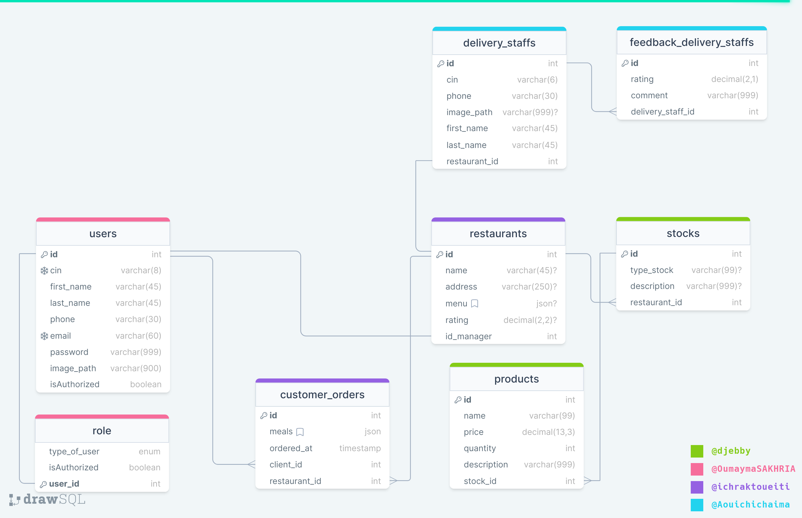

### `elife` est le nom de notre base de données mysql.
```sql
CREATE DATABASE elife;
```
### [Les tables et la relation entre elles](https://drawsql.app/teams/ada-lovelace/diagrams/meals-to-elife)




### [Configuré JavaFX dans Visual Studio Code](https://openjfx.io/openjfx-docs/#IDE-VSCode)
### [Télécharger mysql-connector-java-5.1.49](http://ftp.iij.ad.jp/pub/db/mysql/Downloads/Connector-J/)

### [Télécharger jackson-all-1.9.9.jar](http://www.java2s.com/Code/Jar/j/Downloadjacksonall199jar.htm)

### les étapes a suivi pour utiliser `JDBC`
- ajouter `mysql-connector-java-5.1.49.jar` à `Referenced Libraries` et importer la Bibliothèque
    ```java 
    import java.sql.*;
    ```
- Registrer le driveur
- etablire la connection
- créé une statement
- executer la requête sql
- analyse du resultat
- fermer la connexion
## :warning: Respecter le modèle MVC :warning:
